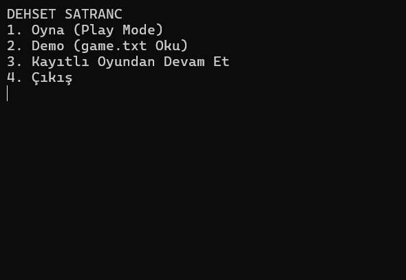
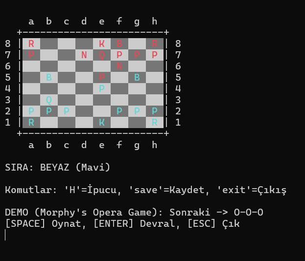

# dehset-chess
A fully functional console-based chess engine built with C#
# ♟️ DEHSET CHESS

**DEHSET CHESS** is a comprehensive console-based chess engine developed in **C#**. This project was created as part of the **EED 1005 - Introduction to Programming** course at Dokuz Eylül University (DEU).

The application simulates a complete chess game logic without using external chess libraries, relying entirely on custom algorithms for move validation, board representation, and special rules.

## 🚀 Features

* **Dual Game Modes:**
    * **Play Mode:** Interactive 2-player mode with input validation.
    * **Demo Mode:** Automated game replay parsing moves from a text file.
* **Advanced Move Logic:** Fully implemented checks for piece geometry and legal moves.
* **Special Moves Supported:**
    * Castling (Kingside & Queenside) 
    * Pawn Promotion (Auto-Queen) 
    * En Passant Captures 
* **Save & Load System:** Ability to save the current game state and resume later.
* **Smart Hint System:** Pressing `H` calculates and lists all possible legal moves for the current turn.
* **Dynamic Console UI:** * Color-coded pieces (Cyan for White / Red for Black).
    * Side-by-side move history display.

## 🎮 How to Play

1.  **Clone the repository** or download the source code.
2.  Open the project in **Visual Studio** or any C# compatible IDE.
3.  Run the application.
4.  **Controls:**
    * Enter moves using standard Algebraic Notation (e.g., `e4`, `Nf3`, `O-O`).
    * **`H`**: Show Hints (Available Moves).
    * **`save`**: Save the current game to `saved_game.txt`.
    * **`exit`**: Quit the game.

## 🛠️ Technical Details

* **Language:** C# (.NET)
* **Structure:** Console Application
* **Data Structures:** Multidimensional Arrays for board state, Lists for move history.
* **Parsing:** Custom string parsing algorithm to interpret chess notation.

## 📷 Screenshots

| Ana Ekran | Oyun İçi Görüntü |
| :---: | :---: |
|  |  |

### Diğer Detaylar

---

